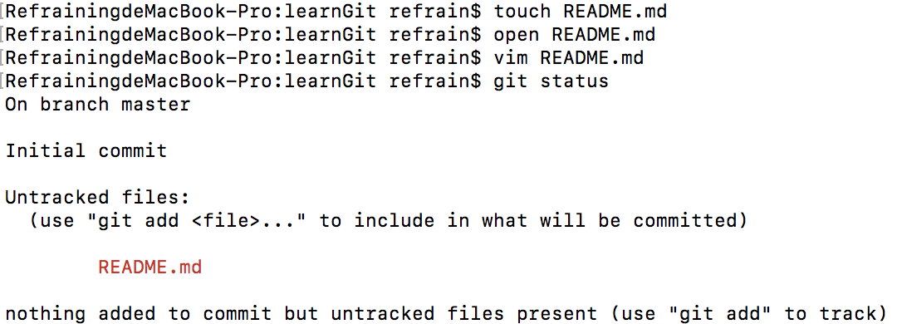
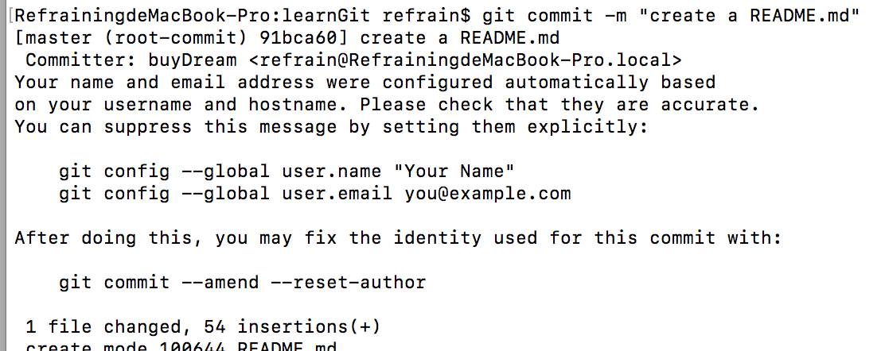
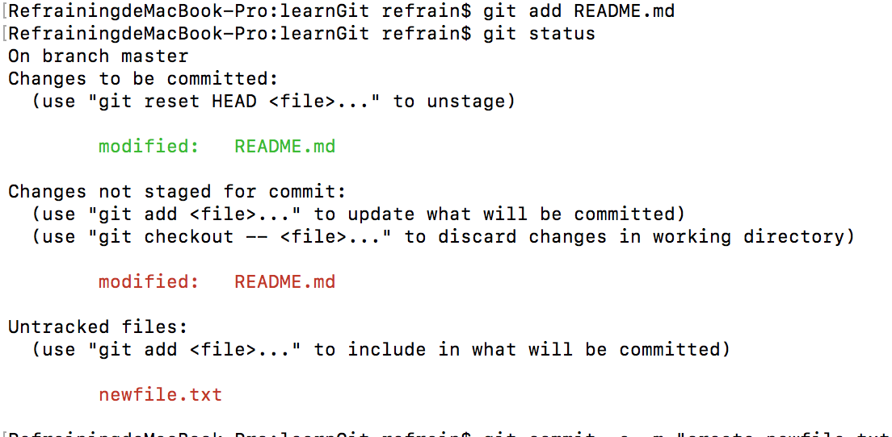
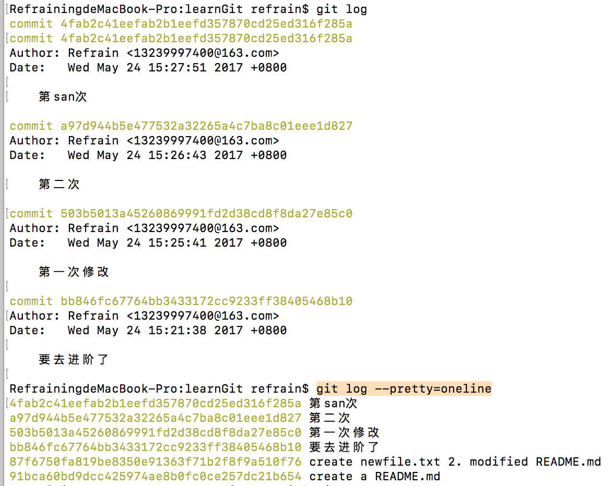
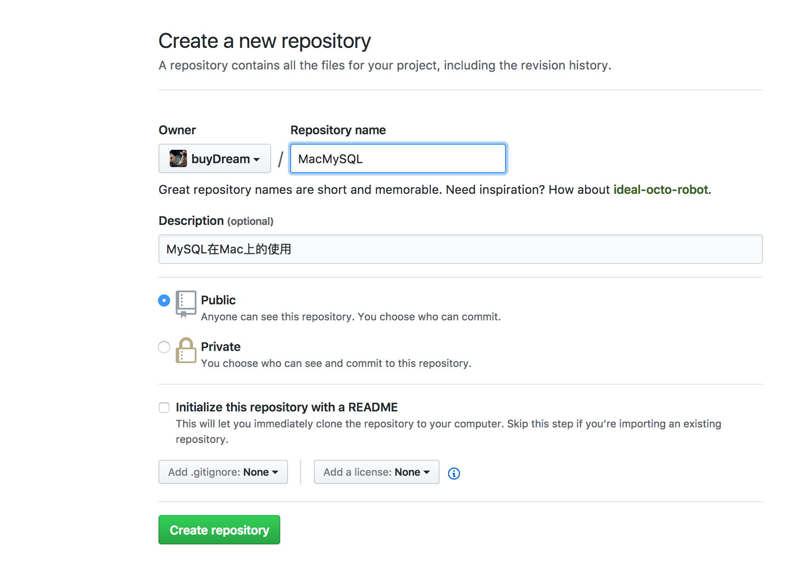

### Git 简单使用

1. #### 在制定路径建立空目录

   cd  <路径>

   mkdir <文件夹名>     #新建文件夹名称

   cd  <文件夹名>   # 

2. #### git init  # 初始化仓库

   

   仓库此时便创建好了，并且告诉你是个空仓库

3. #### 在目录下创建文件

   touch README.md    #

   open README.md  # 打开文件进行编辑（也可使用vim 编辑）

##### 	3.1完成编辑后，可使用git status查看当前git仓库的状态

可看到，有三个文件处于untracked状态，

4. ### 添加到缓存区

   git add README.md 

   ##### 4.1 查看状态

   git status

   

这里就到最后一步了，

##### 	4.1    git diff --cached   查看缓存区那些文件被修改

​		如果发现文件显示不全，按方向键↓显示更多，退出输入q

5. #### 提交到本地

   git commit -m "create one file"

再次查看状态，没有需要commit的，缓存区也被清空

##### 	5.1 如果遇到

​	可以忽视，但最好配置一下。

​	

##### 	5.1 也可使用以下语句提交，它会将没有添加到缓存区的修改也一起提交，但不会添加新建的文件。

​	如，我新建了一个文件newfile.txt，并不把他添加到缓存区

​	在将README.md修改的添加到缓存区

​	再次修改README.md（为了验证没有添加到缓存区的修改）

​	查看状态

​	提交

​	__git commit -a -m "create newfile.txt 2. modified README.md"__

​	再次查看状态

​	修改的部分提交成功了，新建的文件没有成功提交!!!!

# 进阶了

### 1.版本回退与还原

#### 	1.1 多次修改文件（newfile.txt）

#### 	1.2 查看版本log

​		使用git log命令，我一般使用git log --pretty=oneline ，仅展示我需要的信息 

__上图是两者的区别__

#### 	1.3 回到上一个版本（也是“第二次”）

​	__HEAD__表示当前版本

​	放回上上个版本使用HEAD^^

​	返回往上100个版本HEAD~100

#### 	1.4 再回退到之前的版本

​		此时查看log已经找不到以前的版本信息了，但是，只要上面的命令窗口还在，顺着找（窗口关闭了怎么办，我也不知道）

~~~
RefrainingdeMacBook-Pro:learnGit refrain$ git reset --hard 4fab2c41eefab2b1ee
HEAD is now at 4fab2c4 第san次

~~~

​	找到之前版本的版本号（一大窜数字字母)，不用写全，前几位就行，git会自动查找。

再次查看log

还原了！！！

### 2.连接远程仓库

##### 2.1在GitHub上创建远程仓库

远程仓库路径：

##### 2.2 连接远程仓库在终端输入

~~~
$ git remote add origin <远程路径>
~~~

__第一次好像要输入你的GitHub账号和密码，__

##### 2.3 开始上传

~~~
$ git push origin master
~~~

OK！！！